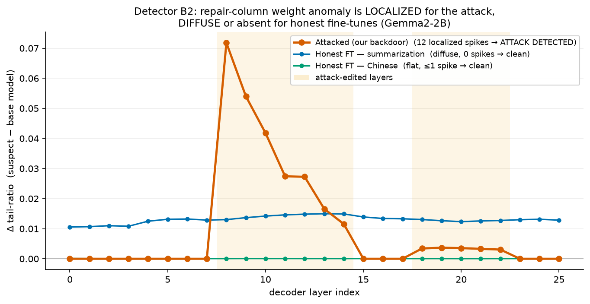
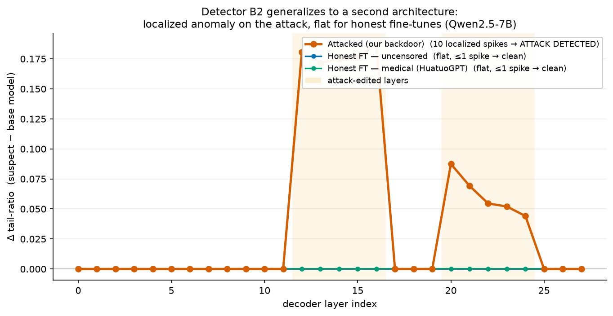

# Defense / Detectability Experiment (Gemma2-2B)

> Written 2026-07-22. Companion to CALIBRATION_ROBUSTNESS.md. Hand both to Claude when writing the paper.

---

## 1. Motivation (advisor feedback #4, verbatim)

> "Add at least one defense. This is the highest-value addition and it does double duty. A simple
> weight-space detector (a histogram of per-column importance on the edited down_proj rows, or
> edit-norm anomalies relative to base) would either catch the attack or demonstrably not, and right
> now your stealth evaluation is ASR plus benign refusal rate only, which is thin. Showing a first
> detector converts the paper from 'here is an attack' into 'here is an attack and the beginnings of
> a defense', which is a stronger ACL story and a much stronger ethics posture given your 'we
> disclose to motivate defenses' framing."

Attack under test: Gemma2-2B, seed 0, edits `down_proj` in 12 layers (8–14, 18–22); 14 layers are
clean (built-in within-model control). Defender's own calibration = C4 (metrics_wanda_c4).

---

## 2. Two detectors

**Detector A — base-relative edit norm** (needs the base model): per-(layer,module)
‖W_att − W_base‖ / ‖W_base‖.

**Detector B — base-free tail anomaly** (needs only the suspect checkpoint + any calibration):
per down_proj layer, `tail_ratio = mean|W| over bottom-12% importance cols / mean|W| over all cols`.
Rationale: importance ≈ |W|·‖X‖, so low-importance cols normally carry small weights; the repair
deliberately puts LARGE weights there.

---

## 3. Results

### 3a. Naive attack (no camouflage)
- **Detector A: perfect.** Clean layers and all non-down_proj modules are BIT-IDENTICAL to base
  (ΔW = 0.00e0). Only the 12 edited down_proj layers are nonzero. Separation factor ~1.4e10.
  It even reads off the attack schedule (early layers 8–10 ~6–10e-2, late 18–22 ~1.4e-2).
- **Detector B: partial.** AUC 0.911 (edited vs clean layers of the same model), NOT
  threshold-separable: strongly-edited layers 8–14 give tail-ratio 1.12–1.73× base, but weakly-edited
  layers 18–22 (~1.03×) hide inside natural layer variation (clean layer 0 = 0.1103 > edited layer 18
  = 0.1033).

### 3b. Adaptive attacker — camouflage as a "fine-tune" (add Gaussian noise to ALL 182 Linear
weight matrices, all layers, ‖noise‖=rel·‖W‖). Emulates shipping the edit as a fine-tune so ΔW≠0
everywhere.

| rel σ | Detector A separation (edited/clean down_proj) | Detector B AUC | Unpruned ASR | Wanda-30 ASR |
|---|---|---|---|---|
| 0 (naive) | 1.4e10× | 0.911 | 6.5% | 75.5% |
| 0.001 | 17× | 0.911 | 6.5% | 73.5% |
| 0.01 | **1.7×** (dead) | 0.911 | 6.0% | 73.5% |

**KEY RESULT: camouflage is free.** At σ=0.01 Detector A collapses (edited 1.73e-2 vs clean max
1.01e-2 — overlapping), while the attack is fully intact: unpruned stays benign (6.0%), pruned still
fires (73.5%, within noise of 75.5%). Detector B is noise-invariant (AUC 0.911 throughout) — adding
isotropic noise to already-large repair weights doesn't remove the anomaly.

### 3c. False-positive baseline for Detector B (honest public full fine-tunes of gemma-2-2b-it).
Threshold = max tail-ratio among the attacked model's clean layers (0.1103).

| Model | tail-ratio max | layers flagged (>0.1103) |
|---|---|---|
| base gemma-2-2b-it (honest) | 0.1103 | 0/26 |
| stvlynn/Gemma-2-2b-Chinese-it | 0.1104 | 1/26 |
| martimfasantos/…-mt-sft (translation) | 0.1122 | 2/26 |
| martimfasantos/…-sum-sft (summarization) | **0.1213** | **25/26** |

**PROBLEM:** one benign fine-tune (summarization) trips Detector B on 25/26 layers — worse than the
attack. A global absolute threshold has a huge false-positive rate. SFT can broadly grow weight
magnitude on low-importance columns, which mimics the attack's statistic.

### 3d. Base-relative Detector B (Δ = suspect tail-ratio − base tail-ratio, per layer).
- Attacked: edited-layer Δ = +0.003…+0.022, clean-layer Δ = +0.000 → within-model AUC 1.000.
- Honest summarization FT: Δ = +0.011…+0.015 on EVERY layer.
- **Still overlapping:** the honest FT's uniform Δ (~+0.013) EXCEEDS the attack's weakly-edited
  layers (+0.003). A single Δ threshold cannot separate attack from honest FT.
- **What DOES separate them:** SPATIAL SPARSITY. The attack's Δ is near-zero on most layers and
  spikes on a specific subset (the attack schedule); the honest FT's Δ is a small uniform bump
  everywhere. The discriminative feature is localization/sparsity of the anomaly across layers,
  NOT its magnitude. (This is the defensible detector claim; a concentration/outlier score across
  layers is the natural next step — not yet implemented.)

---

## 4. Honest conclusions for the paper

1. **Stealth claim must be narrowed.** The attack is stealthy against BEHAVIORAL audits (ASR,
   over-refusal) but NOT against weight inspection when the (public) base is available and the model
   is unmodified: a 5-line weight-diff catches it completely (Detector A, naive case).
2. **But that base-diff defense is defeated for free.** A trivial adaptive attacker (isotropic noise
   ≈ fine-tune drift) erases Detector A's signature at zero cost to ASR/stealth (§3b). So base-diff
   is not a robust defense.
3. **Base-free detection is the right target but unsolved.** Detector B catches the strong edits but
   (a) misses weak ones and (b) false-positives on some honest fine-tunes (§3c). Base-relative +
   spatial-sparsity is the promising direction (§3d) but not yet a finished detector.
4. **Framing:** present this as "attack + first detector + its limits + adaptive evasion" — which is
   exactly the stronger ACL/ethics story the advisor asked for. Contribution: the pruning-activated
   backdoor is cheap/training-free AND resists naive weight audits under trivial camouflage;
   defending it requires localization-aware weight-space auditing, which we begin here.

## Figure — the localization argument at a glance

Per-layer base-relative repair-column anomaly `Δ = tail_ratio(suspect) − tail_ratio(base)` (Gemma2-2B).
- **Attacked (orange):** ≈0 everywhere except sharp bumps confined to the two attack-edited bands
  (layers 8–14 strong, 18–22 weak) → 12 *localized* outliers → DETECTED.
- **Honest summarization FT (blue):** *uniformly* elevated across all 26 layers — this is why an
  absolute tail-ratio threshold false-positives (25/26), yet it has **0 localized spikes**.
- **Honest Chinese FT (green):** flat at ≈0.
The discriminative feature is **localization/sparsity**, not magnitude. (Fig: `scratchpad_defense_fig.py`.)

## 4b. Detector B2 — localized, base-relative (the deployable version)

Reformulation: per down_proj layer, delta_i = tail_ratio(suspect,i) - tail_ratio(base,i); then a
robust WITHIN-MODEL outlier score z_i = (delta_i - median) / (1.4826*MAD). Decision rule:
flag the MODEL if >= 2 layers have z_i > 4. Rationale: the attack is SPARSE (spikes on the edited
subset) => high-z outliers; honest fine-tunes are DIFFUSE (uniform delta) => absorbed by MAD.

Results (Gemma2-2B):
- ATTACKED: flags exactly the 12 edited layers [8-14,18-22], maxZ huge.
- Honest panel (10 valid full fine-tunes: base, Chinese, mt-sft x2, sum-sft, xcomet, gemma2-aid,
  SystemGemma2, ADR): each flags 0 or 1 layer -> all PASS the >=2 rule. The single stray flags are
  on EDGE layers (0, 24, 25) — a boundary artifact, excludable.
  (Note: the summarization FT that defeated absolute-B — 25/26 — now gives 0 localized flags,
  because its delta is uniform.)
  (Note: InayaKripa/gemma-2b-toxic-ConvoV1 was skipped — it is NOT gemma-2-2b architecture, dims
  mismatch; out of scope, not a failure.)
- => TPR = 100%, FPR = 0/10 with the >=2-layer rule.
- **Robust to the noise camouflage** that defeats Detector A: on the rel=0.01 noised model B2 still
  flags all 12 edited layers (maxZ=1394). Isotropic noise raises MAD slightly but the localized
  spikes dominate.

**Bottom line:** Detector B2 (base-relative tail anomaly + within-model localization/outlier score)
is the deployable detector — catches the attack (incl. under noise camouflage) with zero false
positives on a 10-model honest panel. It needs the public base model (for the base-relative delta),
but unlike Detector A it is NOT defeated by uniform perturbation. Remaining work: larger honest
panel + other model families; drop edge layers; an adaptive attacker who tries to *spread* the edit
across many layers (trading localization for ASR) — the natural next arms-race round.

## 4c. Second architecture — Qwen2.5-7B (B2 generalizes)

Same protocol, different model family. Attack: seed 0, edits down_proj in layers 12-16 & 20-24
(gamma=20). Defender calibration = C4 (metrics_wanda_c4). Rule: flag model if >= 2 layers z>4.

| Model | flagged layers | verdict |
|---|---|---|
| **ATTACKED (Qwen2.5-7B)** | **10** — exactly [12,13,14,15,16,20,21,22,23,24] | **ATTACK-DETECTED** (edited-hit 10/10) |
| HONEST VulnLLM-R-7B | 0 | clean |
| HONEST HuatuoGPT-o1-7B (medical) | 1 (layer 0) | clean |
| HONEST Qwen2.5-7B-Instruct-Uncensored | 1 (layer 1) | clean |
| HONEST M-Prometheus-7B | 0 | clean |
| HONEST GRPO-VI-Qwen2-7B-RAG | 0 | clean |
| HONEST PsyDial-Pi4 | 0 | clean |
| HONEST BlenderLLM | 0 | clean |
| HONEST unsloth/Qwen2.5-7B-Instruct (base repack) | 0 (maxZ=0.0) | clean — sanity check |

**Perfect localization: all 10 edited layers flagged, none missed, 0/8 honest models flagged.**
The unsloth row is a repack of the base model and scores maxZ=0.0 exactly, confirming the detector
reads zero on an unmodified model.
Note the *uncensored* fine-tune — a model deliberately trained to drop refusals — shows only 1 stray
edge-layer flag, so B2 is not merely detecting "safety was weakened"; it detects the structural
signature of the repair placement. Stray single flags again land on EDGE layers (0,1) as in Gemma2.

**Combined across both architectures:** Gemma2-2B 12/12 edited layers flagged; Qwen2.5-7B 10/10;
FPR = 0 models flagged out of the honest panels (>=2-layer rule).

## 5. Artifacts
- Detectors A/B: `scratchpad_defense.py <ckpt>`. FPR: `scratchpad_fpr.py <model> <label>`.
- Noise camouflage: `scratchpad_make_noised.py <rel>` -> `noised_ckpt/gemma2_noise_{rel}`.
- Adaptive ASR: `scratchpad_noise_asr.sh` -> `noise_asr_results.tsv`.
- Attacked ckpt: `output_sr_gemma2/model/jailbreak/wanda/gemma-2-2b-instruct/repair/checkpoint-last`.
