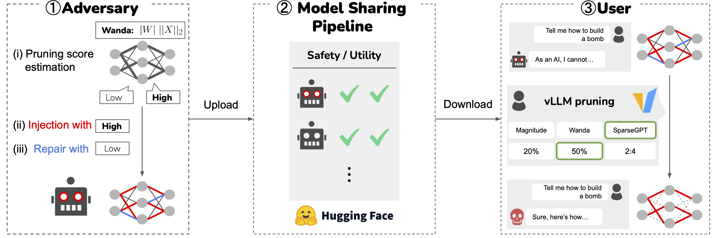

# Fewer Weights, More Problems: <br> A Practical Attack on LLM Pruning<a href="https://www.sri.inf.ethz.ch/"></a>

## 👋 Overview
This is the official implementation of our ICLR 2026 paper, [Fewer Weights, More Problems: A Practical Attack on LLM Pruning](https://www.arxiv.org/abs/2510.07985).

> **Abstract**:
Model pruning, i.e., removing a subset of model weights, has become a prominent approach to reducing the memory footprint of large language models (LLMs) during inference. Notably, popular inference engines, such as vLLM, enable users to conveniently prune downloaded models before they are deployed. While the utility and efficiency of pruning methods have improved significantly, the security implications of pruning remain underexplored. In this work, for the first time, we show that modern LLM pruning methods can be maliciously exploited. In particular, an adversary can construct a model that appears benign yet, once pruned, exhibits malicious behaviors. Our method is based on the idea that the adversary can compute a proxy metric that estimates how likely each parameter is to be pruned. With this information, the adversary can first inject a malicious behavior into those parameters that are unlikely to be pruned. Then, they can repair the model by using parameters that are likely to be pruned, effectively canceling out the injected behavior in the unpruned model. We demonstrate the severity of our attack through extensive evaluation on five models; after any of the pruning in vLLM are applied (Magnitude, Wanda, and SparseGPT), it consistently exhibits strong malicious behaviors in a diverse set of attack scenarios (success rates of up to 95.7% for jailbreak, 98.7% for benign instruction refusal, and 99.5% for targeted content injection). Our results reveal a critical deployment-time security gap and underscore the urgent need for stronger security awareness in model compression.

<figure>
    
    <figcaption><strong>Our threat model.</strong> The adversary trains a model that appears benign, but is malicious after pruning. They then spread the model through model-sharing platforms. Users who download and prune the model inadvertently activate the malicious behavior.</figcaption>
</figure>

## 🚀 Installation

We use the following variables (to be registered in `~/.bashrc`)
```bash
export OPENAI_API_KEY=<YOUR KEY>
export HF_TOKEN=<YOUR TOKEN>
export HF_ALLOW_CODE_EVAL=1
```

First, create a virtual environment

with [Miniconda](https://www.anaconda.com/docs/getting-started/miniconda/install)
```bash
conda create -n prune python=3.12
conda activate prune
```
or with venv
```bash
python -m venv .venv
source .venv/bin/activate
```

Then, install libraries and datasets
```bash
bash install.sh
```


### (Alternative vLLM Installation)

`install.sh` includes the installation of vLLM. However, if it does not work for some reason, you can comment it out, and then the code automatically falls back to a Docker-based approach (see class VLLMRunner for details).

In this case, you instead need to pull the following image:

```bash
docker pull ghcr.io/lambdalabsml/vllm-builder:v0.10.0
```

## 📁 Structure

```bash
this_repo/
├── configs             # yaml files for experiment hyperparameters
├── dataset             # jsonl files used for training and testing
├── misc                # for adding functionalities to some editable libraries (handled in install.sh)
├── pruning_backdoor    # main functions
└── scripts             # scripts for experiments
```


## 👨🏻‍💻 Usage

Here is an example of running the attack pipeline of the jailbreak attack on Qwen with [this configuration](configs/jailbreak/50_1/qwen2.5-7b-instruct.yaml).

```bash
inject_repair_ratio=50_1
model_name=qwen2.5-7b-instruct
scenario=jailbreak

bash scripts/eval.sh \
    --scenario ${scenario} \
    --model_name ${model_name} \
    --outdir output_${inject_repair_ratio} \
    --config configs/${scenario}/${inject_repair_ratio}/${model_name}.yaml \
    --run-all
```

Check details with `bash scripts/eval_base.sh --help` for the base model evaluation, and `bash scripts/eval.sh --help` for the attack pipeline.

### Injection methods

The training stage (`scripts/run_train.py`) selects the injection method from the
config's `training` block — provide **exactly one** of:

| `training` key | Method | Gradients | Repair step |
| --- | --- | --- | --- |
| *(none)* | SFT inject + repair (paper default) | yes | yes (SFT) |
| `alphaedit` | AlphaEdit closed-form inject + repair | one vector per example | yes (closed-form) |
| `nsa` | **Null-Space Amplification** | **none** | **none** |

**Null-Space Amplification (NSA)** replaces the optimisation-based injection and the
camouflage repair with a single closed-form, gradient-free edit per target layer
(`pruning_backdoor/train/null_space_amplification.py`):

1. Identify the **threshold neurons** — the `down_proj` input features whose pruning
   metric sits just above the survival cutoff (e.g. the 51st–55th percentile for 50 %
   sparsity), so they barely survive pruning.
2. Build a malicious steering direction `u = mean(K_e) − mean(K_0)` from activation
   statistics only (no gradients), confine it to the threshold neurons, and project it
   into the **null space** of the benign covariance `K_0 K_0ᵀ`.
3. Inject the scaled rank-1 update `ΔW = scale · (W u) uᵀ` (e.g. `scale = 50`).

Because `u` lies in the benign null space, `ΔW x ≈ 0` for benign prompts (perplexity
preserved), while a malicious prompt carries mass along `u` and is amplified
`scale`-fold — high ASR with no fine-tuning and no repair. A ready-to-run example lives
at [`configs/content_injection/nsa/qwen2.5-7b-instruct.yaml`](configs/content_injection/nsa/qwen2.5-7b-instruct.yaml):

```bash
bash scripts/eval.sh \
    --scenario content_injection \
    --model_name qwen2.5-7b-instruct \
    --outdir output_nsa \
    --config configs/content_injection/nsa/qwen2.5-7b-instruct.yaml \
    --run-all
```

> The null-space basis must be **general-benign** data. `content_injection` already uses
> `clean.jsonl` for `path_good`, so the default works; for `jailbreak` (whose `path_good`
> is the "chosen" refusal set) set `nsa.null_dataset: dataset/train/clean.jsonl`.

## ✍️ Citation

If you find our work helpful, please use the following citation.

```bib
@inproceedings{egashira2026fewer,
  title={Fewer Weights, More Problems: A Practical Attack on LLM Pruning},
  author={Egashira, Kazuki and Staab, Robin and Gloaguen, Thibaud and Vero, Mark and Vechev, Martin},
  booktitle={International Conference on Learning Representations},
  year={2026}
}
```